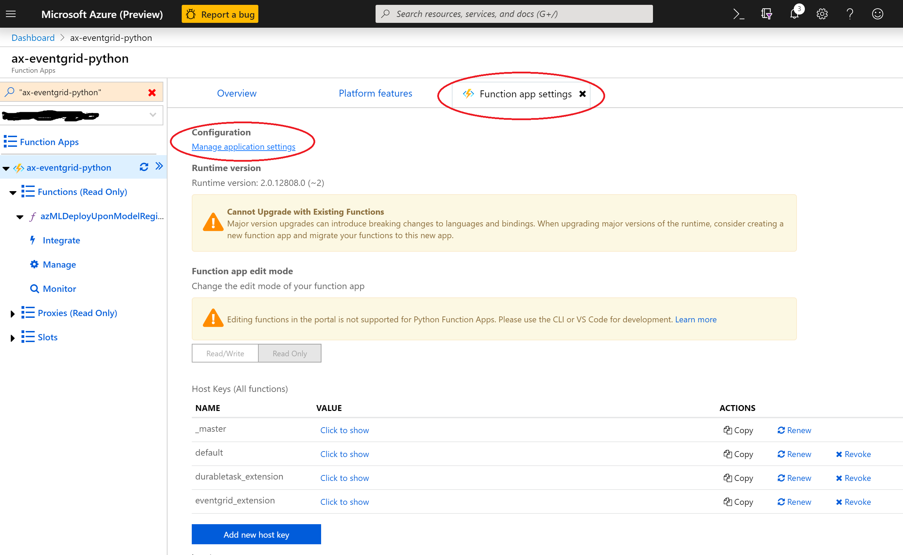
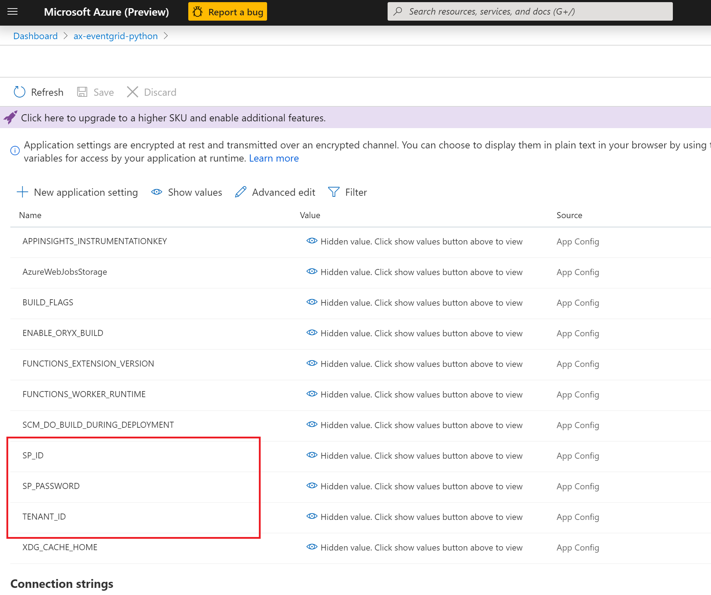

# Perform Azure Machine Learning No Code Deployment (NCD) in Azure Functions triggered by Azure Event Grid

This sample repo showcases an event-driven way to perform Azure Machine Learning no code deployment. It contains an Azure Function which is triggered by `Microsoft.MachineLearningServices.ModelRegistered` event published from Azure Event Grid.

## Prerequsites:
1. Have an Azure subscription
2. Register Azure Machine Learning and Azure Event Grid resource providers in your subscription if they are not registered yet. (**Note**: If Azure Machine Learning and Azure Event Grid were registered before Nov. 5, 2019, you will need to re-register them in your subscription. This is an one time thing.) 
3. Create an Azure Machine Learning workspace
4. Create a service principal and grant it contributor access to your Azure Machine Learning workspace. **TODO** add CLI command

## Deploy the Azure Function

1. Install [Azure Functions Core Tools] (https://www.npmjs.com/package/azure-functions-core-tools) if you haven't.
2. go to AzFunction directory, replace <APP_NAME> with the name of your app and run following command:
```
func azure functionapp publish <APP_NAME> --build remote
```
3. go to Azure Portal, your Functions App, choose "Manage application settings".


   Then set following application settings: 
    * TENANT_ID: the tenant ID of your service principal
    * SP_ID: the service principal ID
    * SP_PASSWORD: the service principal password


## Configure Event Grid Trigger

You can configure your Function App triggering based on Event Grid events, and set advanced filtering conditions based on model tags. **TODO**: add more descriptions and screenshots.

## Register Model

Run following Azure Machine Learning CLI command.
```
az ml model register -n ncd-sklearn-model -p Model/sklearn_regression_model.pkl --model-framework ScikitLearn --cc 1 --gb 0.5 --tag ncd=true --tag stage=production -g <RESOURCE_GROUP_NAME> -w <WORKSPACE_NAME>
```

That will raise a `Microsoft.MachineLearningServices.ModelRegistered` event from your Azure Machine Learning workspace. The event is published via Azure Event Grid to your Functions App, which performs a no code deployment for the model you just registered.